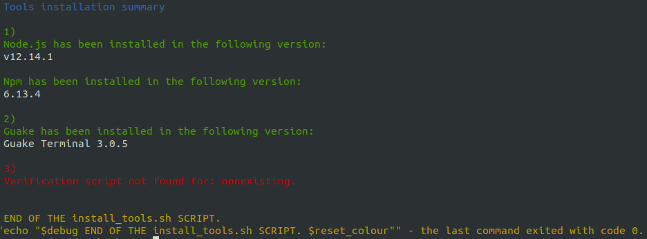

# ubuntu-web-dev-tools-installer


This project offers a bash script useful when you want to set up your development environment with only one command.

To learn how to set up a project like this one, check out the [How to install development tools on Ubuntu with a single bash command](https://keepgrowing.in/tools/how-to-install-development-tools-on-ubuntu-with-a-single-bash-command/) post.

## Getting Started

To clone the repository, run in the command line:
```bash
$ git clone https://github.com/little-pinecone/ubuntu-web-dev-tools-installer.git
```

## Usage

To see all available options type the following command:
```
$ ./install.sh -h
```

To install tools, type the following command providing script file names as parameters:
```
$ sudo ./install.sh nodejs angular guake
```

You will be prompt to accept the installation:


To run only the verification scripts for provided tools run the following command:
```
$ ./install.sh -v nodejs angular guake
```

### Remember

* keep an eye on the order in which you install your tools - the script will install given tools in the same order as specified in parameters;
* before running installation scripts, the `apt update -y` command will be run automatically.

### Example

* Angular requires nodejs, therefore you should run the installation with the `$ sudo ./install.sh nodejs angular` command.
* You will get `permission denied` error if you run the script without `sudo`.

## Customization

You can add your own installation and verification scripts. Remember to keep commands regarding one tool in a separate `*.sh` file. Thanks to that, it will be easier to debug failures and retry installation.

### Remember:

* the installation script file name should clearly indicate what tools is being installed;
* the verification script file name should contain `_verify` suffix added to the same name as used in the installation file;
* put the scripts in the `scripts/tools/` directory.

### Example:

* installation script: `scripts/tools/angular.sh`
* verification script: `scripts/tools/angular_verify.sh` 

## Testing

__Requires [docker](https://docs.docker.com/install/linux/docker-ce/ubuntu/) to be already installed on your machine.__ Checkout `scirpts/tools/docker` and run `$ ./install.sh docker` if the script satisfies your needs.

The project contains `Dockerfile` and `docker-compose.yml` files to provide you with an Ubuntu18.04 instance where you can test the script. All `*.sh` files are already copied to the `/home` directory in the container.

* Start the container based on the provided image:
```
$ docker-compose up -d
```

* Enter the container:
```
$ docker exec -it ubuntuwebdevtoolsinstaller_test_1 /bin/bash
```

* List the directory content to see that you can access the `install.sh` file and the `scripts` directory:
```
/home # ls -la
total 16
drwxr-xr-x    1 root     root          4096 Jan 15 14:45 .
drwxr-xr-x    1 root     root          4096 Jan 15 14:46 ..
-rwxrwxr--    1 root     root          1129 Jan 15 13:21 install.sh
drwxr-xr-x    4 root     root          4096 Jan 15 14:45 scripts
```

> If you have changed the image, or any script that you intend to test there, remember to rebuild the image and remove the container with the following commands:
```
$ docker-compose build
$ docker container rm -f ubuntuwebdevtoolsinstaller_test_1
```
> Then you can create a new container and enter it:
```
$ docker-compose up -d
$ docker exec -it ubuntuwebdevtoolsinstaller_test_1 /bin/bash
```

## Troubleshooting

In case one installation script fails, you can call the command again after fixing the problem. Remember to remove those parameters that were successfully installed prior the failing tool.

## Example screenshots

### Help command

```
$ ./install.sh -h
```


### Verification command

```
$ ./install.sh -v nodejs guake nonexisting
```




